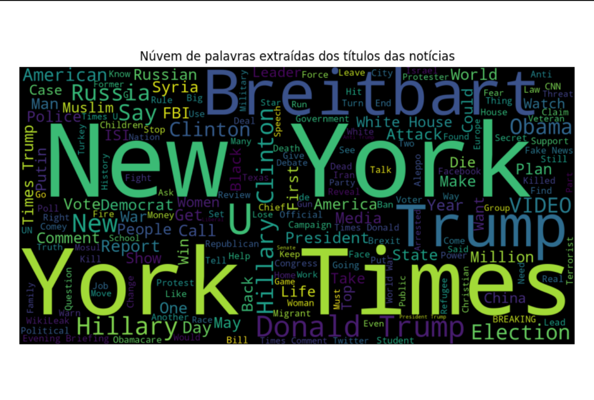
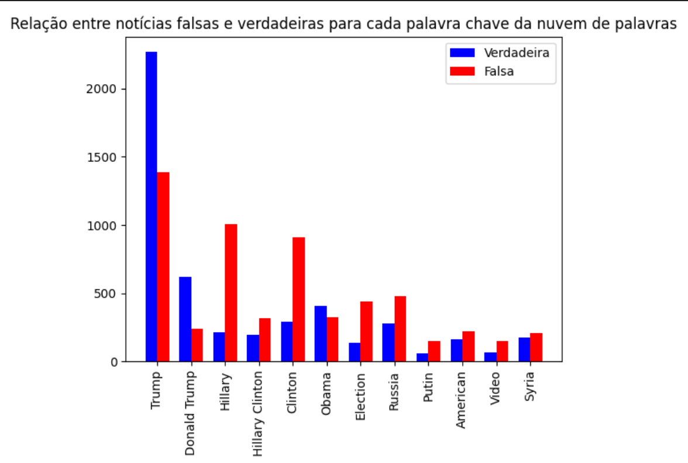
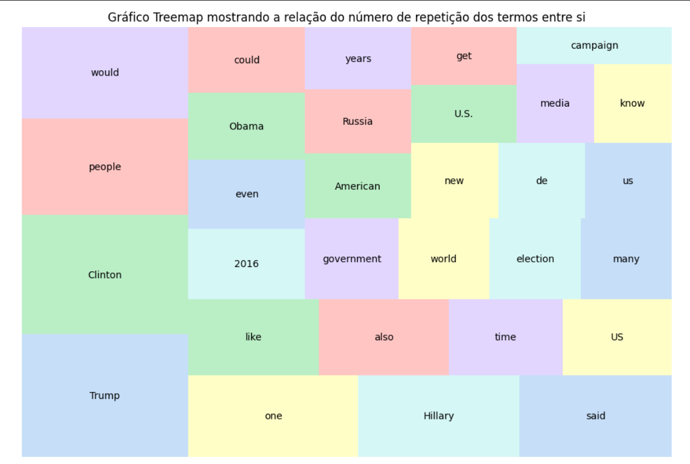

### Projeto de Visualização da Informação

Projeto apresentado como requisito para obtenção de nota parcial no semestre.

#### Motivação

Com esse projeto, deseja-se extrair e visualizar informações relevantes de um conjunto de dados sobre fake news em notícias publicadas durante as eleições Norte Americanas de 2018.

#### Abordagem Escolhida

Seria possível realizar uma série de análises e buscas dentro desta base de dados, porém optou-se por fazer a visualização de uma **núvem de palavras** buscando entender quais termos se repetem com maior frequência nos títulos das notícias.
Outra visualização foi relacionar os 11 termos que tiveram maior destaque com a classificação da notícia como verdadeira ou falsa. Assim um novo dataset foi criado contendo somente as noticias que apresentavam um ou mais termos. A análise consistiu em agrupar essas notícias por termos e label (verdadeiro/falso) e gerar um gráfico de barras que mostre quantas vezes esses termos foram utilizados em notícias verdadeiras e falsas respectivamente.
A úlima visualização foi realizada através do agrupamento das notícias por autor e a contagem de notícias falsas que cada autor publicou. Esse será um gráfico de blocos onde seja possível verificar qual a proporção de notícias falsas cada autor publicou em relação aos outros e ao todo.

### DataSet

É possível encontrar o dataset completo na plataforma do [Kaggle](https://www.kaggle.com/competitions/fake-news/overview)

### Vamos começar

É possível rodar o projeto abrindo o arquivo *fake_news.ipynb* deste projeto dentro do [Jupyter Notebook](https://jupyter.org) ou rodar o script python *fake_news.py*

1 - Em sua primeira execução, tanto pelo Jupyter, quanto pelo terminal python, deve-se instalar as bibliotecas. Para isso pode-se:

* Descomentar o código do arquivo no *.ipynb* e rodar a célula

* Copiando os códigos comentados no arquivo *.py* e os executando no terminal do python

Obs.: essa operação só precisa ser feita na primeira vez que o script for executado. As linhas descomentadas podem ser comentadas novamente.

2 - Após esse passo pode-se rodar em sequencia todas as células do arquivo *.ipynb* ou executar o arquivo *.py*. Serão geradas 3 visualizações, conforme descrito.

### Visualizações Disponíveis

#### WordCloud

É uma núvem de palavras que mostra facilmente a importância de um termo em relação aos outros baseado na sua repetição

#### Gráfico de Barras

É uma forma de comparar valores de uma mesma entrada. Nesse exemplo está comparando o número de notícias verdadeiras e falsas que apresentam um dos 16 termos mais importantes segundo a núvem de palavras.

#### Treemap

É uma forma de visualização que dispõe os dados analisados de forma hierarquica entre si.

